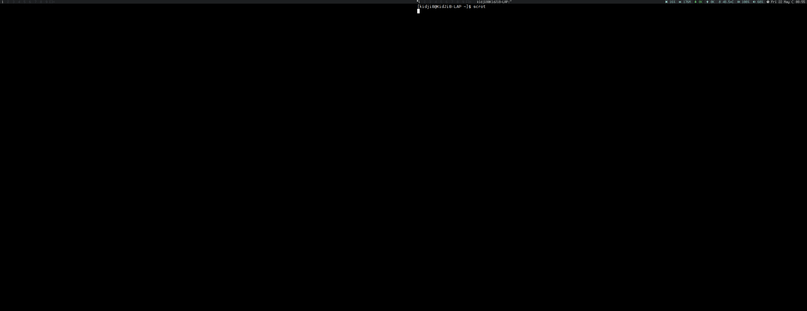
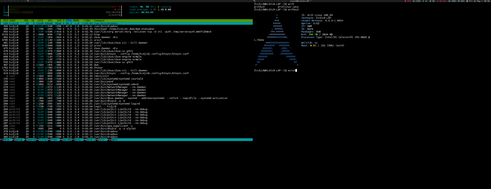

## dwm

This is my config for dwm, screenshot are below. This config also have icons on statusbar.

## Install

You can use a script in this folder to install/recompile dwm

## Status bar

You can find my statusbar script in this repo
